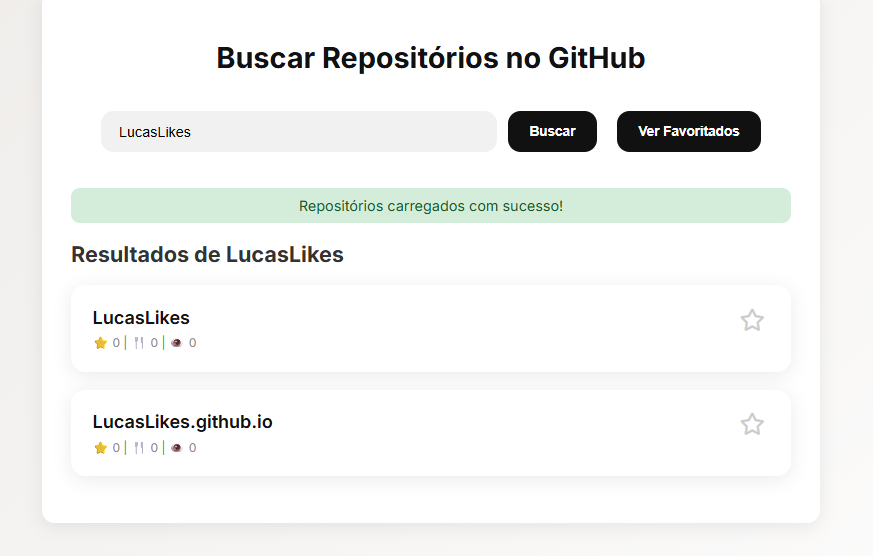
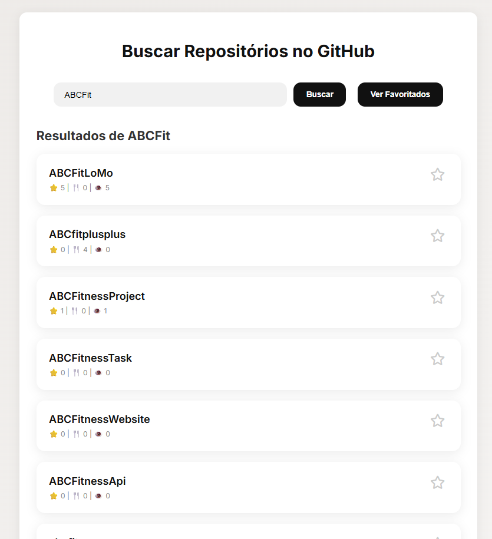
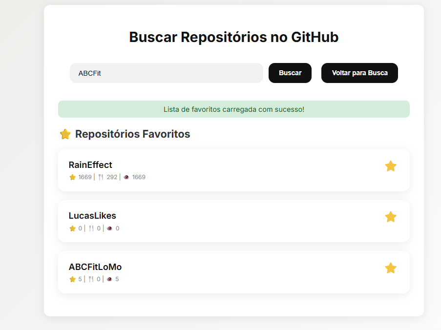
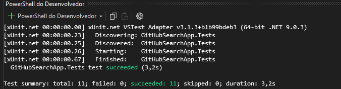
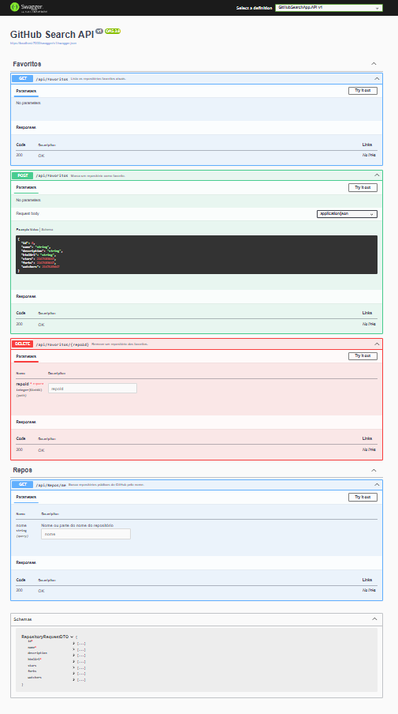

# GitHub Search App

Aplicação para busca de repositórios públicos no GitHub, marcação de favoritos e organização dos resultados por relevância, com integração via ASP.NET Core.

---

## 📄 Descrição

Este projeto consiste em um backend ASP.NET Core que integra com a API pública do GitHub para pesquisar repositórios públicos, permitir que o usuário marque favoritos (armazenados em memória) e organize os resultados com base em uma lógica de relevância personalizada. Além disso, os testes unitários cobrem a lógica de negócios, como a ordenação de repositórios e a gestão dos favoritos.

---

## 🚀 Funcionalidades Implementadas

- [x] Buscar repositórios públicos do GitHub
- [x] Marcar/desmarcar repositórios como favoritos
- [x] Listar favoritos
- [x] Ordenar repositórios por relevância
- [x] Testes unitários da lógica de relevância
- [x] Documentação via Swagger
- [x] Frontend funcional com consumo de API

---

## 🔍 Funcionalidades

### 📦 Busca de Repositórios Públicos
Pesquisar repositórios públicos no GitHub por nome ou parte do nome.

### ⭐ Gestão de Favoritos
Adicionar e remover repositórios aos seus favoritos em tempo de execução (sem persistência em banco de dados usando **IMemoryCache**).

### 🔥 Ordenação por Relevância
Organização dos resultados pela relevância usando a fórmula:
**Estrelas * 2 + Forks + Watchers**

### 📘 API Documentada com Swagger/OpenAPI
A API é auto-documentada e pode ser testada diretamente via Swagger.

---

## 🏗️ Estrutura do Projeto

```
GitHubSearchApp/
│    GitHubSearchApp.API
│    │
│    ├── Connected Services
│    ├── Dependencies
│    ├── Properties
│    ├── Controllers
│    │   ├── FavoritesController.cs
│    │   └── ReposController.cs
│    ├── DTOs
│    │   ├── RepositoryRequestDTO.cs
│    │   └── RepositoryResponseDTO.cs
│    ├── appsettings.json
│    ├── GitHubSearchApp.API.http
│    └── Program.cs
│    │
│    GitHubSearchApp.Application
│    │
│    ├── Dependencies
│    ├── Interfaces
│    │   ├── IFavoritesService.cs
│    │   ├── IGitHubService.cs
│    │   ├── IRelevanciaService.cs
│    │   └── IRepositorioService.cs
│    ├── Services
│    │   ├── FavoritesService.cs
│    │   ├── GitHubService.cs
│    │   ├── RelevanciaService.cs
│    │   └── RepositorioService.cs
│    │
│    GitHubSearchApp.Domain
│    │
│    ├── Dependencies
│    ├── Entities
│    │   └── Repository.cs
│    ├── Repository.cs
│    └── Interfaces
│        └── IGitHubRepository.cs
│    │
│    GitHubSearchApp.Infrastructure
│    │
│    ├── Dependencies
│    ├── Logging
│    │   └── FileLogger.cs
│    ├── Repositories
│    │   └── GitHubRepository.cs
│    │
│    GitHubSearchApp.Tests
│    │
│    ├── Dependencies
│    ├── GitHubRepositoryErrorTest.cs
│    ├── GitHubRepositoryTimeoutTest.cs
│    ├── RepositorioServiceIntegrationTests.cs
│    └── RepositorioServiceTests.cs
└── README.md
```

---

## 🔢 Endpoints Principais

- `GET /api/Repos/me?nome={nome}` - Buscar repositórios no GitHub
- `GET /api/Favoritos` - Listar favoritos
- `POST /api/Favoritos` - Adicionar repositório aos favoritos (Json)
- `DELETE /api/Favoritos/{id}` - Remover repositório dos favoritos

---

## ⚙️ Lógica de Relevância

Estrelas * 2 + Forks + Watchers (Estrelas representam o principal indicador de interesse no repositório, por isso têm peso dobrado. )


Critérios considerados:
- **Estrelas (stars):** Popularidade do repositório
- **Forks:** Cópias do repositório feitas por outros usuários
- **Watchers:** Usuários acompanhando o repositório

---

## ✅ Testes

A aplicação conta com testes automatizados desenvolvida com **xUnit** e **Moq**, cobrindo os principais fluxos e regras de negócio da aplicação:

- **Cálculo de relevância**: Garante que a fórmula `Stars * 2 + Forks + Watchers` seja aplicada corretamente.
- **Ordenação por relevância**: Verifica se os repositórios são ordenados corretamente do mais relevante para o menos relevante.
- **Favoritos**: Testa os métodos de adicionar e remover repositórios da lista de favoritos, assegurando consistência na manipulação de dados.
- **Listagens**: Valida o comportamento do sistema ao retornar listas vazias ou com dados inválidos da API do GitHub.
- **Mocks e isolamento**: Utiliza **Moq** para simular serviços e garantir que os testes sejam independentes e previsíveis.
- **Teste de integração (em progresso)**: Há uma estrutura inicial para testar chamadas reais à API usando `HttpClient`, que será evoluída para validar o comportamento completo da aplicação.

---

## 🧪 Demonstrações

### 🔍 Busca de Repositórios




### ⭐ Favoritar Repositórios


### ✅ Testes Unitários


### ✅ Swagger

---

## 🛠️ Tecnologias Utilizadas

- .NET 9 (C#)
- ASP.NET Core Web API
- HttpClientFactory
- Swagger / OpenAPI
- xUnit e Moq (testes unitários)

---

## 🛠️ Customizações no Frontend

O frontend em Angular foi ajustado para:

- Exibir os dados de forma mais amigável
- Organizar os favoritos em uma seção própria
- Aplicar melhorias visuais básicas sem foco em design

---

## 📦 Como Executar

```bash
git clone <url-do-repositório>
dotnet restore
dotnet run
```

Abra o navegador em `https://localhost:<porta>/swagger` para testar a API.

---

## ✨ Próximos Passos

- Autenticação e autorização de usuários
- Integração contínua e deploy automatizado

---

## 👤 Autor

**Lucas Gabriel Likes**  
Engenheiro de Software